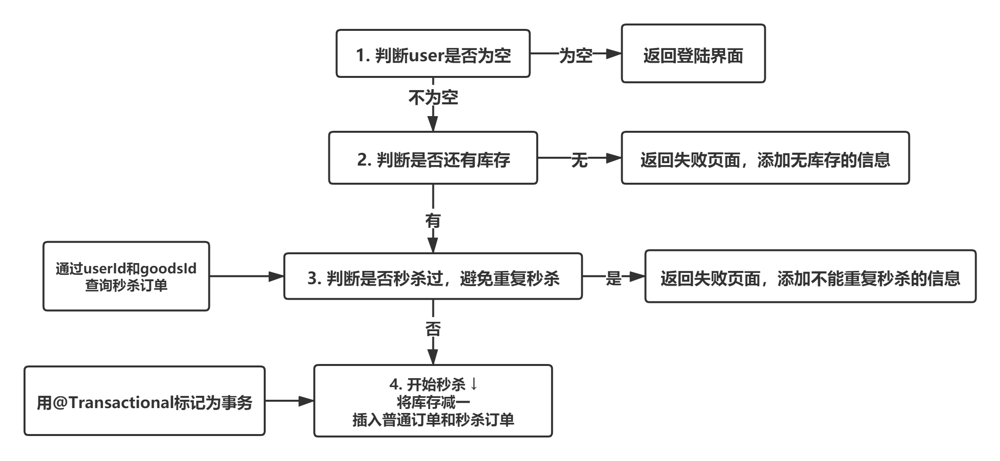

1.Result类用于结果返回

2.Redis,keyPrefix前缀(模板方法)

3.fastjson存储对象到redis

4.登录过程2次md5
- 第一次:固定salt值,针对传输安全,http是明文传输
- 第二次:随机salt值,针对数据库安全.

5.JSR参数校验，自定义注解ConstraintValidator

6.GlobalException 

7.redis分布式Session

8.拦截器AccessInterceptor extends HandlerInterceptorAdapter

9.参数校验WebConfig extends WebMvcConfigurerAdapter
添加UserArgumentResolver implements HandlerMethodArgumentResolver

10.页面缓存thymeleafViewResolver

11.对象缓存getById

12.页面静态化：去掉Model向前端传值的逻辑，只留下业务处理过程，并将所需要的的值封装在GoodsDetailVo对象中
为了防止视图解析器的跳转，将html写为htm

13.


##用到的技术

##实现的模块

###添加Fastjson依赖
用于序列化在redis中保存
- ```JSON.toJavaObject(JSON.parseObject(str), clazz);```
- ```JSON.toJSONString(value);```
###结果集
用于返回Result
###key前缀
因为是高并发项目,防止redis的key冲突覆盖
###两次MD5：
>1：用户端：PASS=MD5(明文+固定+Salt)
>2: 服务端：PASS=MD5(用户输入+随机Salt)
>?防止跑字典, 统计登录失败次数,过多则逻辑删除。
###JSR303参数校验+全局异常处理器<br> 
>JSR303参数校验(自定义注解进行手机号格式验证) 
>定义全局异常处理某一类异常从而能够减少代码重复率和复杂度（@ExceptionHandler）
>@ExceptionHandler：统一处理某一类异常，从而能够减少代码重复率和复杂度 
>@ControllerAdvice：异常集中处理，更好的使业务逻辑与异常处理剥离开
>@ResponseStatus：可以将某种异常映射为HTTP状态码 
##redis分布式session:
 >通过UUIDUtil获取随机数作为token,吧唯一token作为用户的唯一标识符保存到redis中 通过Cookie吧token返回给客户端<br> 
 >通过重写WebMvcConfigurerAdapter下的方法 在进入到Controller前在redis中获取用户信息 这样减少代码的冗余 在需要用户信息的方法中注入用户实体类<br> 
###秒杀逻辑

@SelectKey()在执行完插入方法后，想如下这样通过获取返回值的方法来获取主键id值
###页面高并发优化
>- 页面缓存,手动渲染html
>  在有缓存的情况下，取出缓存在没有缓存的时候，手动渲染，添加缓存
>- 解决超卖(数据库增加唯一索引：防止用户重复购买,sql加库存数量判断：防止库存边负数)
>- 秒杀静态化
>- 对象缓存


##集成redis:
  >>1：添加redis依赖,添加Fastjson依赖（用于序列化）
  >>2: 加载redis配置文件(RedisConfig 使用@ConfigurationProperties来读取配置文件)<br> 
  >>3: 通过RedisConfig获取JedisPool池 吧JedisPool注入到spring容器中 供RedisService使用<br> 
  >>4: 为了防止多人开发项目下key被别人覆盖（同意使用前缀 不同模块使用不同的前缀 比如说用户模块使用用户模块的前缀）<br>
    >> 通过key封装结构：实现类-》抽象类-》接口

  


##接口优化<br>
  >>Redis 预减库存减少对数据库访问<br>
  >>内存标记减少Redis<br>
  >>请求先入队缓冲（RabbitMQ） 异步下单 增强用户体验<br>
  >>nginx水平扩展<br>
  >>分库分表中间件(Mycat)<br>
  >>思路：减少数据库访问<br>
  >>1:系统初始化，把商品库存数量加载到Redis<br>
  >>2:收到请求 Redis预减库存，库存不足，直接返回，否则进入3<br>
  >>3:请求入队，立即返回排队中<br>
  >>4:请求出队，生成订单，减少库存<br>
  >>5:客户端轮询，是否秒杀成功<br>


  商品秒杀系统——Java并发实战和并发优化

  优化总结：
  - 前端控制：
  暴露接口，按钮防重复
  
  动静态数据分离：CDN缓存，后端缓存
  
  事务竞争优化：减少事务锁时间（存储过程）
  
  - 后端优化
  使用redis缓存热门商品
  
  优化点：暴露接口。
  
  用户可能一直再刷页面。越热的产品访问越多
  
  事务简单优化：秒杀执行优化
  
  行级锁发生在减库存操作
  
  先执行记录购买行为，再执行减库存操作
  
  事务竞争优化
  
  事务SQL在MySql端执行（存储过程）
  
  存储过程优化：事务行级锁持有时间
  
  不要过多依赖存储过程
  
  简单的逻辑可以应用存储过程
  
  QPS: 一个秒杀单6000/qps
  
  
